# 爬取百度图片各种狗狗的图片，使用caffe训练模型分类

### tag:
______

selenium
PhantomJS
sklearn
BeautifulSoup
caffe

部分依赖文件见当前目录 \*.py

caffe的安装等配置请自行查阅，可以先只编译一个only cpu的

____

## 1. 代理获取

爬一些提供免费代理的网站，获取到的代理要根据速度要求等check，
可扩展爬取的网站，这里只简单爬了两个，代理质量一般，也可以用
Tor不过好像也不怎么好使了


```python
from SpiderProxy import SpiderProxy
import ZLog
ZLog.init_logging()
```


```python
pxy = SpiderProxy()
pxy.spider_proxy360()
pxy.spider_xicidaili()
pxy.check_proxy()
pxy.save_csv()
```

    211.151.48.60:8080 check ok
    139.196.108.68:80 check ok
    110.178.198.55:8888 check ok
    106.75.128.90:80 check ok
    60.194.100.51:80 check ok
    117.57.188.176:81 check ok
    45.32.19.10:3128 check ok
    110.181.181.164:8888 check ok
    39.87.237.90:81 check ok
    111.206.81.248:80 check ok
    47.89.53.92:3128 check ok
    112.87.106.217:81 check ok
    218.89.69.211:8088 check ok
    139.59.180.41:8080 check ok
    124.133.230.254:80 check ok
    128.199.186.153:8080 check ok
    192.249.72.148:3128 check ok
    112.112.70.116:80 check ok
    128.199.178.73:8080 check ok
    178.32.153.219:80 check ok
    79.141.70.78:3128 check ok
    119.6.136.122:80 check ok
    46.219.78.221:8081 check ok
    proxy_list len=23


## 2. 狗狗分类数据获取


```python
import SpiderBdImg
```

爬虫的可设置项：
- g_enable_show: 是否使用有界面浏览器还是使用PHANTOMJS
- g_enable_proxy: 浏览器的进程是否启用代理，默认不需要，下载原图一定是使用代理没有开关
- g_enable_debug: 单进程，单线程调试模式可以debug断点
- g_enable_stream: 使用流下载图片
- K_SCROLL_MOVE_DISTANCE = 200: 模拟js window下滑距离，增大提高爬取速度
- K_SCROLL_SLEEP_TIME = 3 
- K_COLLECT_PROCESS_CNT = 3: 同时启动进程个数

由于使用了线程池控制max线程数，所以就算你提高K_SCROLL_MOVE_DISTANCE，K_SCROLL_SLEEP_TIME也不会有下载速度的提升，
需要修改线程池初始化现在设置了3倍代理数量，具体详看代码：
    with ThreadPoolExecutor(max_workers=len(self.back_proxys) * 3) as executor:


**默认启动google有界面浏览器了，因为代理质量太差，所以就起了三个进程，如果要启动多个进程在乎效率，代理质量够好，要使用PHANTOMJS**

    n_jobs = 3
    if g_enable_debug:
        n_jobs = 1
    parallel = Parallel(
        n_jobs=n_jobs, verbose=0, pre_dispatch='2*n_jobs')

    parallel(delayed(do_spider_parallel)(proxy_df, ind, search_name) for ind, search_name in enumerate(search_list))
    
**使用selenium配合BeautifulSoup，requests爬取图片，达到目标数量或者到所有图片停止
具体请参考SpiderBdImg**


```python
SpiderBdImg.spider_bd_img([u'拉布拉多', u'哈士奇', u'金毛', u'萨摩耶', u'柯基', u'柴犬',
                            u'边境牧羊犬', u'比格', u'德国牧羊犬', u'杜宾', u'泰迪犬', u'博美', u'巴哥', u'牛头梗'],
                            use_cache=True)
```

    makedirs ../gen/baidu/image/金毛
    makedirs ../gen/baidu/image/哈士奇
    makedirs ../gen/baidu/image/拉布拉多
    makedirs ../gen/baidu/image/萨摩耶
    makedirs ../gen/baidu/image/柯基
    makedirs ../gen/baidu/image/柴犬
    makedirs ../gen/baidu/image/边境牧羊犬
    makedirs ../gen/baidu/image/比格
    makedirs ../gen/baidu/image/德国牧羊犬
    makedirs ../gen/baidu/image/杜宾
    makedirs ../gen/baidu/image/泰迪犬
    makedirs ../gen/baidu/image/博美
    makedirs ../gen/baidu/image/巴哥
    makedirs ../gen/baidu/image/牛头梗


## 3.  清洗数据

人工大概扫一下图片，把太过份的删了，不用太仔细，太概扫扫就完事,  这工具其实也是可以自动识别的，先自己扫扫吧


## 4. 数据标准化
        
为caffe的lmdb做准备将图片都转换成jpeg，具体参考ImgStdHelper
        
运行成功后所有图片为jpeg后缀名称


```python
import ImgStdHelper

ImgStdHelper.std_img_from_root_dir('../gen/baidu/image/', 'jpg')
```

## 5. 准备训练模型


```python
!../sh/DogType.sh
```


```python
data_path = '../gen/dog_judge/data.txt'
print(open(data_path).read(400))
```

    哈士奇/001e5dd0f5aa0959503324336f24a5ea.jpeg 1
    哈士奇/001eae03d6f282d1e9f4cb52331d3e20.jpeg 1
    哈士奇/0047ea48c765323a53a614d0ed93353b.jpeg 1
    哈士奇/006e3bd75b2375149dab9d0323b9fc59.jpeg 1
    哈士奇/0084e12ec1c15235a78489a0f4703859.jpeg 1
    哈士奇/009724727e40158f5b84a50a7aaaa99b.jpeg 1
    哈士奇/00a9d66c72bbed2861f632d07a98db8d.jpeg 1
    哈士奇/00dabcba4437f77859b1d8ed37c85360.jpeg 1
    


#### 生成数字类别对应的label文件


```python
import pandas as pd
import numpy as np

class_map = pd.DataFrame(np.array([[1, 2, 3, 4, 5, 6], ['哈士奇', '拉布拉多', '博美', '柴犬', '德国牧羊犬', '杜宾']]).T, 
                        columns=['class', 'name'], 
                        index=np.arange(0, 6))
class_map.to_csv('../gen/class_map.csv', columns=class_map.columns, index=True)
```

#### 生成训练、测试数据集 


```python
import TrainValSplit

TrainValSplit.train_val_split(data_path, n_folds=10)
```


```python
train_path = '../gen/dog_judge/train_split.txt'
with open(train_path) as f:
    print('train set len = {}'.format(len(f.readlines())))
val_path = '../gen/dog_judge/val_split.txt'
with open(val_path) as f:
    print('val set len = {}'.format(len(f.readlines())))
```

    train set len = 9628
    val set len = 1066


#### 生成lmdb


```python
!../sh/DogLmdb.sh
```

#### 生成去均值文件


```python
!../sh/DogMean.sh
```

#### 更改train_val.prototxt

见目录sh下pb/train_val.prototxt文件。

#### 更改solver.prototxt

见目录sh下pb/solver.prototxt文件。

## 7. 训练模型

使用bvlc_googlenet的solver.prototxt，train_val.prototxt训练自己的数据

根据训练数据及测试数据的量修改solver.prototxt，train_val.prototxt

由于测试数据大概1000 －> batch_size=50, test_iter: 20

训练数据大概10000 －> test_interval: 1000

display: 100 snapshot: 5000(其实snapshot大点没事，反正没次crl ＋ c结束时会生成mode), 如过需要多留几个做对比，可调小

可以把test的mirror设置true反正数据不算多

修改DogTrain.sh 中CAFEBIN=/root/caffe/build/tools/caffe为你的caffe路径

修改solver.prototxt，train_val.prototxt中所有绝对路径为你的路径，没法使用相对路径除非想对caffe路径，那样更麻烦

详情请参考solver.prototxt，train_val.prototxt

之后使用!../sh/DogTrain.sh开始训练数据，由于要打太多日志，就不在ipython中运行了，单独启个窗口来, 生成caffemodel

## 8. 使用生成的模型进行分类

### 更改deploy.prototxt

见pb/deploy.prototxt文件。

### 加载模型


```python
import caffe
```


```python
caffe.set_mode_cpu()

model_def = '../pb/deploy.prototxt' # 模型文件
model_weights = '../gen/dog_judge/dog_judge_train_iter_5000.caffemodel' # 训练结果
model_mean_file = '../gen/dog_judge/mean.binaryproto' # 均值文件

net = caffe.Net(model_def, model_weights, caffe.TEST)  
```


```python
# 均值处理
mean_blob = caffe.proto.caffe_pb2.BlobProto()
mean_blob.ParseFromString(open(model_mean_file, 'rb').read())
mean_npy = caffe.io.blobproto_to_array(mean_blob)
mu = mean_npy.mean(2).mean(2)[0]
print('mu = {}'.format(mu))

# 颜色格式处理
transformer = caffe.io.Transformer({'data': net.blobs['data'].data.shape})
transformer.set_transpose('data', (2,0,1))  
transformer.set_mean('data', mu)           
transformer.set_raw_scale('data', 255)     
transformer.set_channel_swap('data', (2,1,0))  
```

    mu = [ 116.2626216   129.17550814  137.46700908]


```python
for layer_name, blob in net.blobs.iteritems():
    print(layer_name + '\t' + str(blob.data.shape))
```

    data	(10, 3, 224, 224)
    conv1/7x7_s2	(10, 64, 112, 112)
    pool1/3x3_s2	(10, 64, 56, 56)
    pool1/norm1	(10, 64, 56, 56)
    conv2/3x3_reduce	(10, 64, 56, 56)
    conv2/3x3	(10, 192, 56, 56)
    conv2/norm2	(10, 192, 56, 56)
    pool2/3x3_s2	(10, 192, 28, 28)
    pool2/3x3_s2_pool2/3x3_s2_0_split_0	(10, 192, 28, 28)
    pool2/3x3_s2_pool2/3x3_s2_0_split_1	(10, 192, 28, 28)
    pool2/3x3_s2_pool2/3x3_s2_0_split_2	(10, 192, 28, 28)
    pool2/3x3_s2_pool2/3x3_s2_0_split_3	(10, 192, 28, 28)
    inception_3a/1x1	(10, 64, 28, 28)
    inception_3a/3x3_reduce	(10, 96, 28, 28)
    inception_3a/3x3	(10, 128, 28, 28)
    inception_3a/5x5_reduce	(10, 16, 28, 28)
    inception_3a/5x5	(10, 32, 28, 28)
    inception_3a/pool	(10, 192, 28, 28)
    inception_3a/pool_proj	(10, 32, 28, 28)
    inception_3a/output	(10, 256, 28, 28)
    inception_3a/output_inception_3a/output_0_split_0	(10, 256, 28, 28)
    inception_3a/output_inception_3a/output_0_split_1	(10, 256, 28, 28)
    inception_3a/output_inception_3a/output_0_split_2	(10, 256, 28, 28)
    inception_3a/output_inception_3a/output_0_split_3	(10, 256, 28, 28)
    inception_3b/1x1	(10, 128, 28, 28)
    inception_3b/3x3_reduce	(10, 128, 28, 28)
    inception_3b/3x3	(10, 192, 28, 28)
    inception_3b/5x5_reduce	(10, 32, 28, 28)
    inception_3b/5x5	(10, 96, 28, 28)
    inception_3b/pool	(10, 256, 28, 28)
    inception_3b/pool_proj	(10, 64, 28, 28)
    inception_3b/output	(10, 480, 28, 28)
    pool3/3x3_s2	(10, 480, 14, 14)
    pool3/3x3_s2_pool3/3x3_s2_0_split_0	(10, 480, 14, 14)
    pool3/3x3_s2_pool3/3x3_s2_0_split_1	(10, 480, 14, 14)
    pool3/3x3_s2_pool3/3x3_s2_0_split_2	(10, 480, 14, 14)
    pool3/3x3_s2_pool3/3x3_s2_0_split_3	(10, 480, 14, 14)
    inception_4a/1x1	(10, 192, 14, 14)
    inception_4a/3x3_reduce	(10, 96, 14, 14)
    inception_4a/3x3	(10, 208, 14, 14)
    inception_4a/5x5_reduce	(10, 16, 14, 14)
    inception_4a/5x5	(10, 48, 14, 14)
    inception_4a/pool	(10, 480, 14, 14)
    inception_4a/pool_proj	(10, 64, 14, 14)
    inception_4a/output	(10, 512, 14, 14)
    inception_4a/output_inception_4a/output_0_split_0	(10, 512, 14, 14)
    inception_4a/output_inception_4a/output_0_split_1	(10, 512, 14, 14)
    inception_4a/output_inception_4a/output_0_split_2	(10, 512, 14, 14)
    inception_4a/output_inception_4a/output_0_split_3	(10, 512, 14, 14)
    inception_4b/1x1	(10, 160, 14, 14)
    inception_4b/3x3_reduce	(10, 112, 14, 14)
    inception_4b/3x3	(10, 224, 14, 14)
    inception_4b/5x5_reduce	(10, 24, 14, 14)
    inception_4b/5x5	(10, 64, 14, 14)
    inception_4b/pool	(10, 512, 14, 14)
    inception_4b/pool_proj	(10, 64, 14, 14)
    inception_4b/output	(10, 512, 14, 14)
    inception_4b/output_inception_4b/output_0_split_0	(10, 512, 14, 14)
    inception_4b/output_inception_4b/output_0_split_1	(10, 512, 14, 14)
    inception_4b/output_inception_4b/output_0_split_2	(10, 512, 14, 14)
    inception_4b/output_inception_4b/output_0_split_3	(10, 512, 14, 14)
    inception_4c/1x1	(10, 128, 14, 14)
    inception_4c/3x3_reduce	(10, 128, 14, 14)
    inception_4c/3x3	(10, 256, 14, 14)
    inception_4c/5x5_reduce	(10, 24, 14, 14)
    inception_4c/5x5	(10, 64, 14, 14)
    inception_4c/pool	(10, 512, 14, 14)
    inception_4c/pool_proj	(10, 64, 14, 14)
    inception_4c/output	(10, 512, 14, 14)
    inception_4c/output_inception_4c/output_0_split_0	(10, 512, 14, 14)
    inception_4c/output_inception_4c/output_0_split_1	(10, 512, 14, 14)
    inception_4c/output_inception_4c/output_0_split_2	(10, 512, 14, 14)
    inception_4c/output_inception_4c/output_0_split_3	(10, 512, 14, 14)
    inception_4d/1x1	(10, 112, 14, 14)
    inception_4d/3x3_reduce	(10, 144, 14, 14)
    inception_4d/3x3	(10, 288, 14, 14)
    inception_4d/5x5_reduce	(10, 32, 14, 14)
    inception_4d/5x5	(10, 64, 14, 14)
    inception_4d/pool	(10, 512, 14, 14)
    inception_4d/pool_proj	(10, 64, 14, 14)
    inception_4d/output	(10, 528, 14, 14)
    inception_4d/output_inception_4d/output_0_split_0	(10, 528, 14, 14)
    inception_4d/output_inception_4d/output_0_split_1	(10, 528, 14, 14)
    inception_4d/output_inception_4d/output_0_split_2	(10, 528, 14, 14)
    inception_4d/output_inception_4d/output_0_split_3	(10, 528, 14, 14)
    inception_4e/1x1	(10, 256, 14, 14)
    inception_4e/3x3_reduce	(10, 160, 14, 14)
    inception_4e/3x3	(10, 320, 14, 14)
    inception_4e/5x5_reduce	(10, 32, 14, 14)
    inception_4e/5x5	(10, 128, 14, 14)
    inception_4e/pool	(10, 528, 14, 14)
    inception_4e/pool_proj	(10, 128, 14, 14)
    inception_4e/output	(10, 832, 14, 14)
    pool4/3x3_s2	(10, 832, 7, 7)
    pool4/3x3_s2_pool4/3x3_s2_0_split_0	(10, 832, 7, 7)
    pool4/3x3_s2_pool4/3x3_s2_0_split_1	(10, 832, 7, 7)
    pool4/3x3_s2_pool4/3x3_s2_0_split_2	(10, 832, 7, 7)
    pool4/3x3_s2_pool4/3x3_s2_0_split_3	(10, 832, 7, 7)
    inception_5a/1x1	(10, 256, 7, 7)
    inception_5a/3x3_reduce	(10, 160, 7, 7)
    inception_5a/3x3	(10, 320, 7, 7)
    inception_5a/5x5_reduce	(10, 32, 7, 7)
    inception_5a/5x5	(10, 128, 7, 7)
    inception_5a/pool	(10, 832, 7, 7)
    inception_5a/pool_proj	(10, 128, 7, 7)
    inception_5a/output	(10, 832, 7, 7)
    inception_5a/output_inception_5a/output_0_split_0	(10, 832, 7, 7)
    inception_5a/output_inception_5a/output_0_split_1	(10, 832, 7, 7)
    inception_5a/output_inception_5a/output_0_split_2	(10, 832, 7, 7)
    inception_5a/output_inception_5a/output_0_split_3	(10, 832, 7, 7)
    inception_5b/1x1	(10, 384, 7, 7)
    inception_5b/3x3_reduce	(10, 192, 7, 7)
    inception_5b/3x3	(10, 384, 7, 7)
    inception_5b/5x5_reduce	(10, 48, 7, 7)
    inception_5b/5x5	(10, 128, 7, 7)
    inception_5b/pool	(10, 832, 7, 7)
    inception_5b/pool_proj	(10, 128, 7, 7)
    inception_5b/output	(10, 1024, 7, 7)
    pool5/7x7_s1	(10, 1024, 1, 1)
    loss3/classifier	(10, 6)
    prob	(10, 6)


### 使用模型分类图片样本


```python
import numpy as np
import pandas as pd
import matplotlib.pyplot as plt
import glob
%matplotlib inline

plt.rcParams['figure.figsize'] = (10, 10)   
```


```python
class_map = pd.read_csv('../gen/class_map.csv', index_col=0)
class_map
```


<div>
<table border="1" class="dataframe">
  <thead>
    <tr style="text-align: right;">
      <th></th>
      <th>class</th>
      <th>name</th>
    </tr>
  </thead>
  <tbody>
    <tr>
      <th>0</th>
      <td>1</td>
      <td>哈士奇</td>
    </tr>
    <tr>
      <th>1</th>
      <td>2</td>
      <td>拉布拉多</td>
    </tr>
    <tr>
      <th>2</th>
      <td>3</td>
      <td>博美</td>
    </tr>
    <tr>
      <th>3</th>
      <td>4</td>
      <td>柴犬</td>
    </tr>
    <tr>
      <th>4</th>
      <td>5</td>
      <td>德国牧羊犬</td>
    </tr>
    <tr>
      <th>5</th>
      <td>6</td>
      <td>杜宾</td>
    </tr>
  </tbody>
</table>
</div>


```python
predict_dir = '../abu' 
img_list = glob.glob(predict_dir + '/*.jpeg')
len(img_list)
```


    22


```python
error_prob = []
for img in img_list:
    image = caffe.io.load_image(img)
    transformed_image = transformer.preprocess('data', image)
    plt.imshow(image)
    plt.show()
    net.blobs['data'].data[...] = transformed_image
    output = net.forward()
    output_prob = output['prob'][0]
    print('predicted class is:{}'.format(class_map[class_map['class'] == output_prob.argmax()].name.values[0]))
    if output_prob.argmax() != 2:
        error_prob.append(img)
```


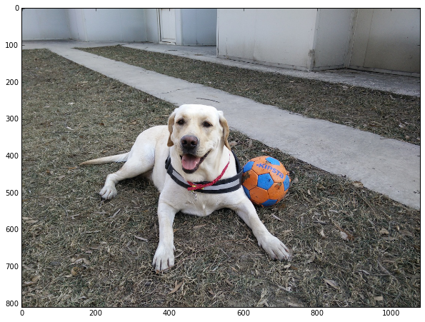


    predicted class is: 拉布拉多


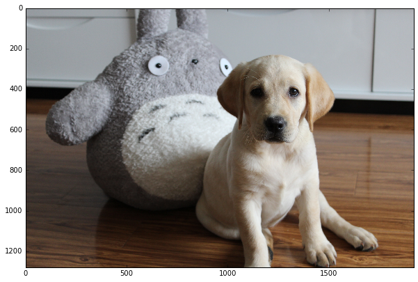


    predicted class is: 拉布拉多


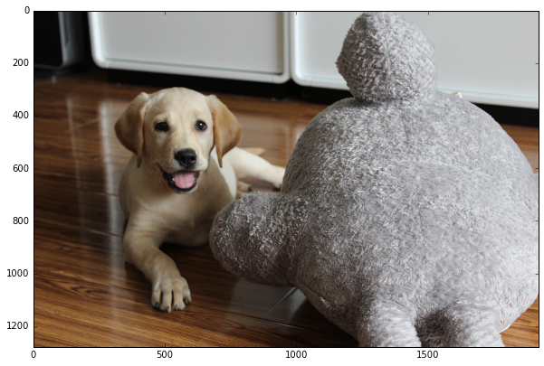


    predicted class is: 拉布拉多


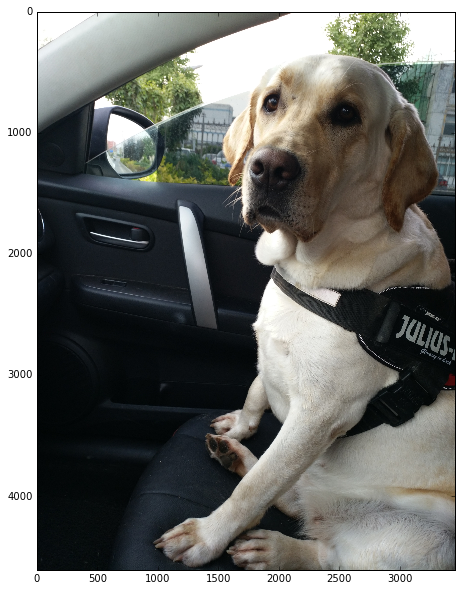


    predicted class is: 拉布拉多


    predicted class is: 拉布拉多


    predicted class is: 拉布拉多


    predicted class is: 德国牧羊犬


    predicted class is: 博美


    predicted class is: 拉布拉多


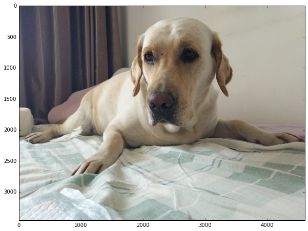


    predicted class is: 拉布拉多


    predicted class is: 拉布拉多


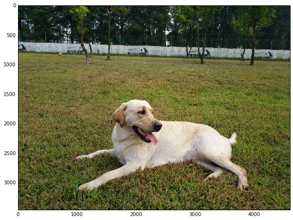


    predicted class is: 拉布拉多


    predicted class is: 杜宾


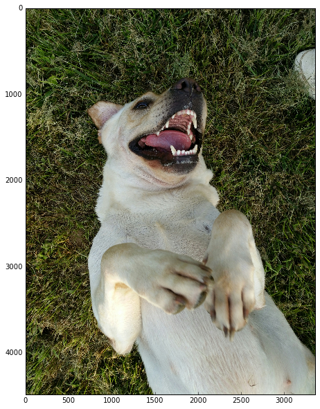


    predicted class is: 拉布拉多


    predicted class is: 拉布拉多


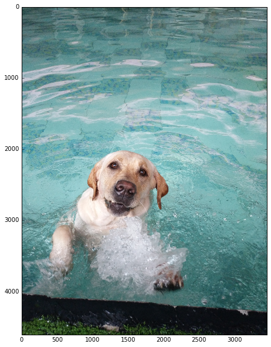


    predicted class is: 拉布拉多


    predicted class is: 拉布拉多


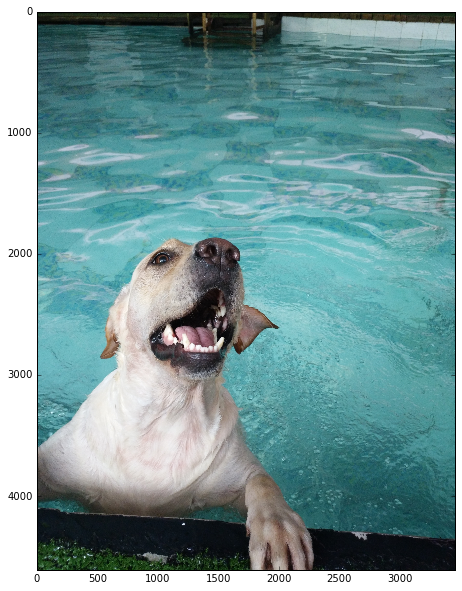


    predicted class is: 拉布拉多


    predicted class is: 杜宾


    predicted class is: 拉布拉多


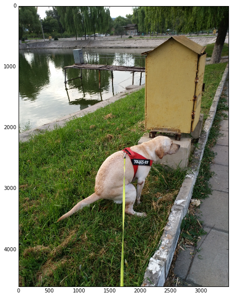


    predicted class is: 拉布拉多


    predicted class is: 拉布拉多


```python
accuary = (len(img_list) - len(error_prob))/float(len(img_list))
accuary
```


    0.8181818181818182


```python
for img in error_prob:
    try:
        image = caffe.io.load_image(img)
    except Exception:
        continue
    transformed_image = transformer.preprocess('data', image)
    plt.imshow(image)
    plt.show()
    net.blobs['data'].data[...] = transformed_image
    output = net.forward()
    output_prob = output['prob'][0]
    top_inds = output_prob.argsort()[::-1]
    for rank, ind in enumerate(top_inds, 1):
        print('probabilities rank {} label is {}'.format(rank, class_map[class_map['class'] == ind].name.values[0]))
```


    probabilities rank 1 label is 德国牧羊犬
    probabilities rank 2 label is 杜宾
    probabilities rank 3 label is 拉布拉多
    probabilities rank 4 label is 柴犬
    probabilities rank 5 label is 博美
    probabilities rank 6 label is 哈士奇


    probabilities rank 1 label is 博美
    probabilities rank 2 label is 柴犬
    probabilities rank 3 label is 拉布拉多
    probabilities rank 4 label is 哈士奇
    probabilities rank 5 label is 杜宾
    probabilities rank 6 label is 德国牧羊犬


    probabilities rank 1 label is 杜宾
    probabilities rank 2 label is 德国牧羊犬
    probabilities rank 3 label is 柴犬
    probabilities rank 4 label is 哈士奇
    probabilities rank 5 label is 拉布拉多
    probabilities rank 6 label is 博美


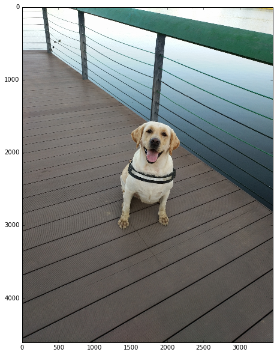


    probabilities rank 1 label is 杜宾
    probabilities rank 2 label is 拉布拉多
    probabilities rank 3 label is 德国牧羊犬
    probabilities rank 4 label is 柴犬
    probabilities rank 5 label is 博美
    probabilities rank 6 label is 哈士奇

